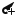
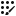

# Character rigging

Follow the below steps to create the bones and skeleton for animating your character:

1. Select the__Create Bone__ tool to begin creating the bones of the character skeleton.

2. With the tool selected, click in the __Sprite Editor __window to define the start-point of the bone. Move the cursor to where the bone should end, and click again to set the bone’s end-point.

3. To create a continuous chain of bones, select the __Create Bone__ tool and click the end-point of an existing bone. The new bone is started from the end-point, creating a chain.

4. Once all bones are created, generate the mesh geometry for the Sprites. It is recommended to use the __Auto Geometry__ tool to autogenerate the Sprites’s geometry mesh. Then refine the geometry with the __Create Vertex__ and __Create Edge__ tools.

5. To edit the bones that influence a Sprite, select the __Bone Influence__ tool and double-click a Sprite to select it. A list of bones currently influencing the Sprite appears.

   - To remove any of the listed bones, select it in the list and click '-' to remove them.

   - To add a bone, select it in the __Sprite Window__ and click + to add it to the list.

6. The weight attached to vertices affects the influence between bones and the Sprites' geometry. Select the  __Auto Weights__ tool to autogenerate the weight of a selected Sprites. To generate weights for all Sprites at once, deselect all Sprites before selecting the tool. Refine the weights of the vertices with the __Weight Brush__ and __Weight Slider__ tools.

7. Test the skeleton rig previewing poses with the __Preview Pose__ tool. Move and rotate the different bones to check their influence on the geometry mesh. Previewing poses can also be done while using the following tools: the __Weight Brush__, __Weight Slider__, __Bone Influence__, __Auto Weights__, and __Visibility__ tools.
- To restore a skeleton rig to its original pose, select __Reset Pose__. The default pose can be edited with the __Edit Joints__ tool.

## Animating

To begin animating, drag your character Prefab into the Scene. This creates a GameObject that reassembles the imported character as it originally appeared in the PSB file. The GameObject contains multiple child GameObjects in the order that represents the bone hierarchy.

With the new GameObject in the scene, begin animating it with the usual [Unity animation workflow and tools](https://docs.unity3d.com/Manual/AnimationSection.html).
