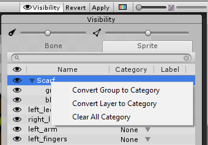

# Context Menu Shortcuts

Right-click on a row in the Sprite Visibility panel of the [Skinning Editor](SkinningEditor.md), to bring up a list of options that allow you to quickly assign the Sprites in that row to a Category. 

 

| Option                        | Function                                                     |
| ----------------------------- | ------------------------------------------------------------ |
| __Convert Group to Category__ | This option is only available if the selected row is a Group that contains multiple Sprites. Select this option to assign all Sprites in the group to a new Category. Unity gives the new Category the same name as the root Group folder’s name. |
| __Convert Layer to Category__ | Select this option assign the Sprite to a Category based on the Sprite’s name. Unity also uses the Sprite's name as the Label name. |
| __Clear All Category__        | Select this to remove all selected Sprites from their currently assigned Category. |

