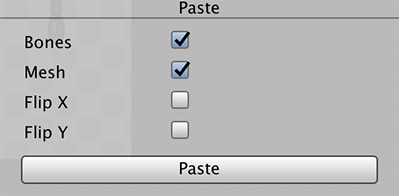

# Copy and Paste Skeleton Rigs

After you have setup the animation skeleton and bone weights for your character, you can reuse the setup for other characters by using the __Copy__ and __Paste__ commands. Currently these commands only affect Sprite data, and only data associated to a Sprite can be transffered between different character setups.

## Copy

To copy a Sprite's data, simply select a Sprite and use the __Copy__ command. If no Sprite is selected, all the Sprites' data currently active in the [Skinning Editor window](SkinningEditor.md) will be copied.

## Paste

To paste a Sprite's data to another Sprite, select the Sprite that you want to paste data on and use the Paste command. Sprite data can be pasted onto another image source. You can also choose what data to paste on the Sprite by clicking on the  __Paste Button__. This will bring up the Paste Dialog

| __Option__ | Function                                      |
| ---------- | --------------------------------------------- |
| __Bones__  | Paste Bone data                               |
| __Mesh__   | Paste the Mesh data                           |
| __Flip X__ | Paste the data with mirrored along the X-axis |
| __Flip Y__ | Paste the data mirrored along the Y-axis      |

The following is shows the behaviour for different scenarios when using the Copy and Paste tool

|                                   | Copy from a Selected Sprite                | Copy With No Sprite Selected                                 |
| --------------------------------- | ------------------------------------------ | ------------------------------------------------------------ |
| __Paste With Sprite Selected__    | Data will be copied to the selected Sprite | All Sprite with the same name from the Copy source will be pasted to the selected image. |
| __Paste With No Sprite Selected__ | No data is pasted                          | All Sprites with the same name from the Copy source will have the data pasted |