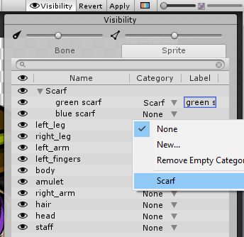

# Editor Integration

The __Skinning Editor__ has two columns in its __Sprite Visibility__ panel, which allow you to specify a __Category__ and __Label__ for a selected Sprite. The __Category__ and __Label__ belong to the __Sprite Library Asset__ of the imported PSB file.

To set a Category for a Sprite:

1. To assign the Sprite to a new Category, navigate to its row in the __Category__ column, open the drop-down menu, and select __New__.

   

2. Enter a name for the Category. Different Category names within the same Library Asset must be unique.

3. When you enter a Category name, Unity automatically assigns that Sprite a __Label__ based on the Sprite’s name. You can change this Label if you want to. Label names must be unique within their Category.

4. To assign the Sprite to an existing __Category__, navigate to its row in the __Category__ column, open the drop-down menu, and select a Category from the list.

   

