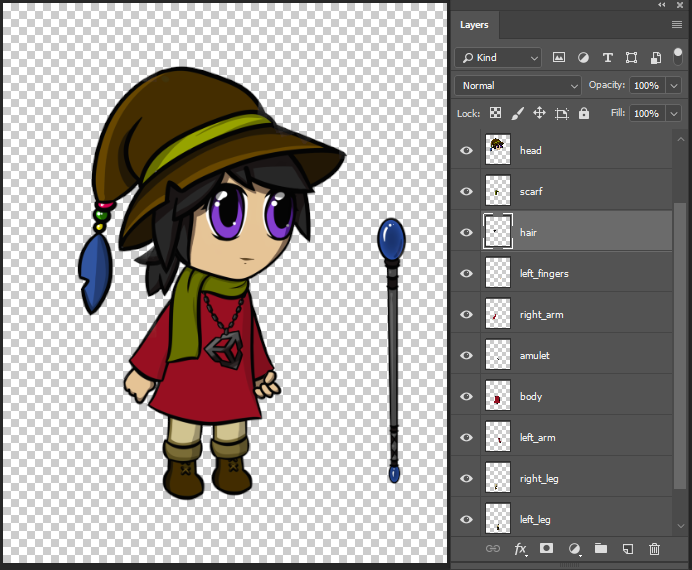
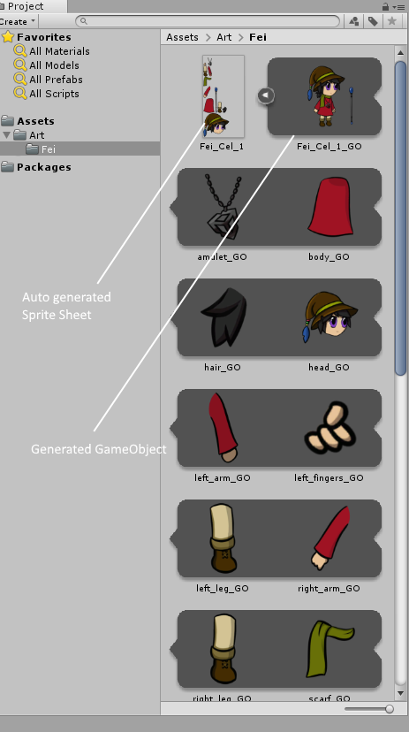
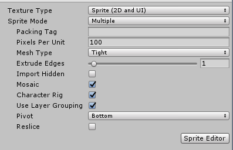

# Preparing And Importing Artwork

It is recommended to arrange and separate the individual parts of your character onto different Layers, as shown in Example 1, when designing your character for animation. Save your artwork as a .PSB file, then import it into your Unity project with the [PSD Importer](https://docs.unity3d.com/Packages/com.unity.2d.psdimporter@latest/index.html?preview=1). The Importer automatically arranges the individual characters parts (prepared as Layers) into a Sprite Sheet layout, as shown in Example 2. 

When importing the graphic data from each Photoshop Layer, the Importer does the following:

1. Arranges/Mosaics the Layers into a Sprite Sheet style layout.
2. Generates a Sprite from each Layer’s graphic data.

Example 1: Layered character artwork in Adobe Photoshop.

Example 2: The layers mosaic into a Sprite Sheet, with a generated Prefab of the character in source pose.

## Importer Settings

Prepare your character by separating the character's limbs and other parts into separate Photoshop Layers, and arrange them in your character’s default pose.

1. Save your artwork as a PSB file in Adobe Photoshop by selecting the __Large Document Format__ under the __Save As__ menu. You can convert an existing PSD file to PSB in the same way.
2. Import the PSB file into Unity as an Asset.
3. Select the Asset to bring up the __PSD Importer__ Inspector window.
4. In the Inspector window, ensure these settings are set (see the example below):
   - Set __Texture Type__ to 'Sprite(2D and UI)'.
   
   - Set __Sprite Mode__ to 'Multiple'.
   
   - Check __Mosaic Layer__.
   
   - Check __Character Rig__.
   
   - Check __Use Layer Grouping__.
     
     

Click __Apply__ to apply the settings when ready. Refer to the __PSD Importer__ package documentation for more information about these settings.