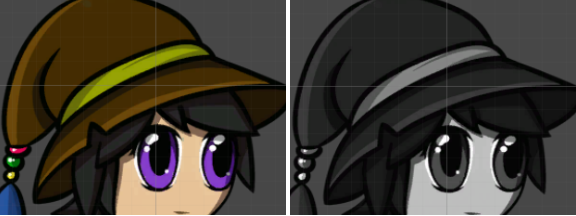
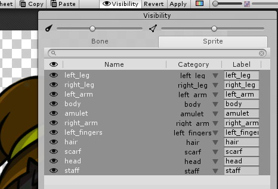
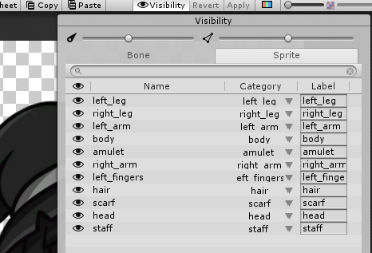
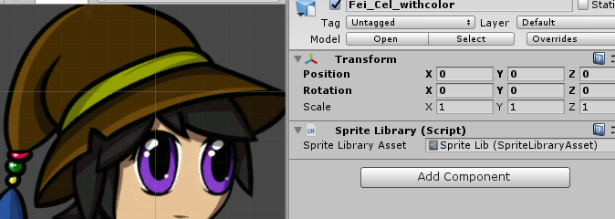
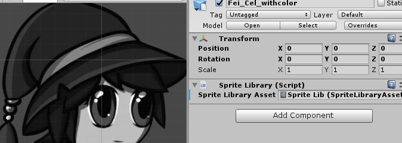

# Swapping Sprite Library Assets

When you need to make a bigger visual change to a Sprite model (for example, switching colors for a character depending on which team it is on), you can use the method detailed in [Changing part of a character’s appearance](CharacterParts.md) for each individual Sprite on the model. 

However, if there are a large number of Sprites you want to change, there is a quicker method that requires additional setup, but allows for a more efficient way to swap all Sprites at once. With this method, you create another __Sprite Library Asset__ with the alternative Sprites, then in the Sprite Library component, swap the Sprite Library Asset to the one that contains the alternative Sprites. 

The following example uses one set of Sprites that are in color, and one set of identical Sprites that are in greyscale.

Here’s an example workflow for the setup of an additional [Sprite Library Asset](SLAsset.md) and how to swap the original Library with it.

1. In your image editor (such as Photoshop), create two versions of the Sprites you need to use. In this example, one is set in color, and the other is set in greyscale.

2. Import the PSB files for each character into Unity. Both appear in the Asset window as separate Prefabs. If your files are not in the PSB format, refer to the steps in [Sprite Swap manual setup](SSManual.md) to manually set up your Sprite Library Assets.

3. In the [Skinning Editor](SkinningEditor.md), assign each part of the characters to a unique __Category __(for example, create a ‘Left Hand’ category for the ‘left hand’ Sprite, and so on).

4. Make sure the corresponding Sprite parts in both Prefabs have the same Category name and Label as their counterpart. For example, the head Sprites of both the color and greyscale characters must be in the same ‘Head’ Category and have the same Label. 

   

   

5. Drag the Prefab for the colorful character into the Scene. In the Inspector window, navigate to its Sprite Library component.

   
   
   
   
6. Next, select the Prefab for the character in greyscale. Drag the Sprite Library Asset from its Sprite Library component’s __Sprite Library Asset__ field, and drop it into the colorful character’s corresponding __Sprite Library Asset __field. This replaces the Asset that was already assigned to it.
   
7. The colorful character’s Sprites should now have switched to their greyscale counterparts in the greyscale character’s Sprite Library Asset.

   

__Known issue__: Because Unity automatically generates the default Sprite Library Asset as a sub-Asset of the Prefabs, both Sprite Library Assets have identical names, and you cannot rename them.