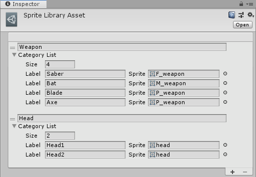

## Sprite Library Asset

Use the __Sprite Library Asset__ to build a collection of Sprites grouped by __Category__. This allows you to create groups of similar Sprites. For example, you might create a Category called __Weapon__, and then add Sprites with the Labels ‘Saber’, ‘Bat’, ‘Blade’, and ‘Axe’. 

To create a __Sprite Library Asset__, go to __Assets__ > __Create__ > __Sprite Library Asset__.

Select the plus (__+__) icon at the bottom-right of the __Sprite Library Asset__ to add a new __Category__.

| Property          | Function                                                     |
| ----------------- | ------------------------------------------------------------ |
| __Category Name__ | Enter a Category name. Category names must be unique.        |
| __Category List__ | Use these settings to define the number of Sprites you want to include, and the label for each Sprite. |
| __Size__          | Enter the number of Labels you want to assign to this Category. |
| __Label__         | Enter a name for the registered Sprite. This Label must be unique from other Labels in the same Category. |
| __Sprite__        | Select or drag a Sprite onto this box to register it as the Sprite reference for this Label. |

