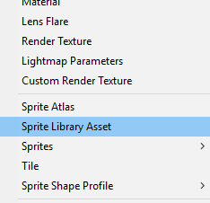
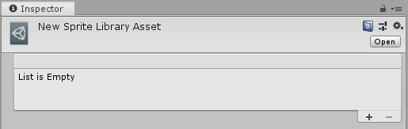
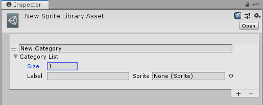
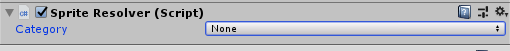

# Sprite Swap Manual Setup

When you import PSB files into the Editor with the  [PSD Importer](https://docs.unity3d.com/Packages/com.unity.2d.psdimporter@latest/index.html?preview=1), Unity automatically assigns them a [Sprite Library Asset](SLAsset.md). If you want to create more Sprite Library Assets manually, follow the steps below to set up all components of the Sprite Swap feature.

1. Create the Sprite Library Asset from the Asset creation menu: __Asset > Create > Sprite Library Asset__.

   
   
   
   
2. Select the new Sprite Library Asset and go to its Inspector window.

   
   
   
   
3. Select the plus (__+__) icon at the bottom-right of the __Sprite Library Asset__ to add a new __Category__. Enter a name for the Category. Category names must be unique.

   
   
   
   
4. Next, create a new GameObject and add the __Sprite Renderer__ component to it.
   
   
   
5. Add the[ Sprite Library component](SLComponent.md) to the same GameObject, and assign the new Sprite Library Asset set up in step 3 to the __Sprite Library Asset__ box.
   

6. Add the [Sprite Resolver component](SRComponent.md) to the same GameObject. 

   

   

7. Select the __Category__ drop-down menu and select the Category you want to apply to this GameObject. If the Category already contains Sprites, the component displays a __Label__ drop-down menu and thumbnail visual selector. You can select any Sprite in the Category.

When you select a Sprite in the Sprite Resolver component, Unity automatically replaces the current Sprite in the [Sprite Renderer](https://docs.unity3d.com/Manual/class-SpriteRenderer.html) component with the one you have selected.

