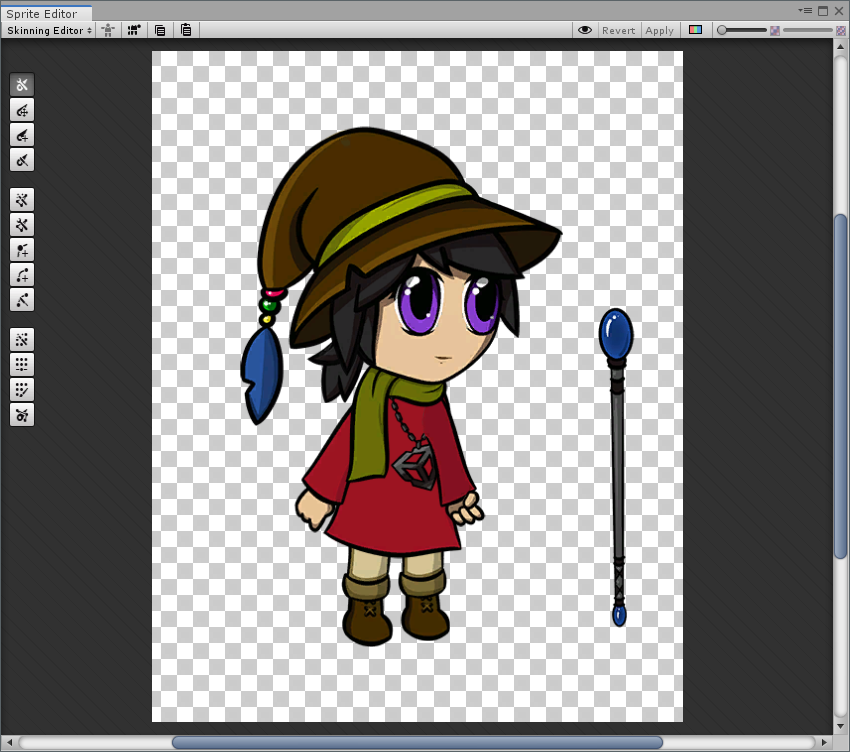

# Tool Preferences

Adjust the 2D Animation tool settings from its Preferences menu by going to menu: __Edit__ > __Preferences__ > __2D__ > __Animation__. It provides several options to customize aspects of the animation tool.

| Setting                    | Function                                                     |
| -------------------------- | ------------------------------------------------------------ |
| __Hide Tool Text__         | Enable this option to hide tool text to have a compact view (see example below). |
| __Selected Outline Color__ | Customize the outline color of selected Sprite and bone.     |
| __Sprite Outline Size__    | Use the slider to adjust the outline thickness of a selected Sprite. |
| __Bone Outline Size__      | Use the slider to adjust the outline thickness of a selected  bone. |

Icons are shown with ‘Compact windows’ enabled.