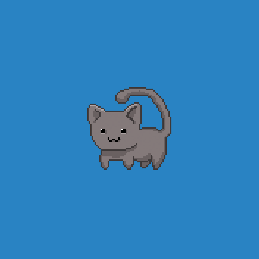
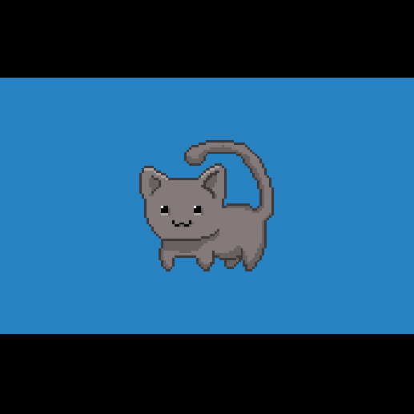

# 2D Pixel Perfect 

## Overview

The **2D Pixel Perfect** package contains the **Pixel Perfect Camera** component which ensures your pixel art remains crisp and clear at different resolutions, and stable in motion.  

It is a single component that makes all the calculations needed to scale the viewport with resolution changes, removing the hassle from the user. The user can adjust the definition of the pixel art rendered within the camera viewport through the component settings, as well preview any changes immediately in Game view by using the Run in Edit Mode feature.

  
The **Pixel Perfect Camera** gizmo in the Scene

Attach the **Pixel Perfect Camera** component to the main Camera GameObject in the Scene, it is represented by two green bounding boxes centered on the **Camera** gizmo in the Scene view. The solid green bounding box shows the visible area in Game view, while the dotted bounding box shows the **Reference Resolution.**

The **Reference Resolution** is the original resolution your Assets are designed for, its effect on the component's functions is detailed further in the documentation.

Before using the component, first ensure your Sprites are prepared correctly for best results with the the following steps.

## Preparing Your Sprites

1. After importing your textures into the project as Sprites, set all Sprites to the same **Pixels Per Unit** value.

    

2. In the Sprites' Inspector window, set their **Filter Mode** to *Point*.

    

3. Set their **Compression** to 'None'

    

4. Follow the steps below to correctly set the pivot for a Sprite
 
    1. Open the **Sprite Editor** for the selected Sprite. 

    2. If Sprite Mode is set to Multiple and there are multiple Sprite elements, then a pivot point must be set for each individual Sprite element.

    3. Under the Sprite settings, select *Custom* from the *Pivot* drop-down menu. Then select *Pixels* from the *Pivot Unit Mode* drop-down menu. This allows you to input the pivot point's coordinatess in pixels, or drag the pivot point around freely in the Sprite Editor and have it automatically snap to pixel corners.

    4. Repeat step 4(3) for each Sprite element as needed.
    
        

## Snap Settings

To ensure the pixelated movement of Sprites are consistent with each other, follow the below steps to set the proper snap settings for your project.

1. Open the **Snap Settings** at menu: Edit > Snap Settings...

2. For **Move X/Y/Z**, set their values to '1 divided by the Asset Pixels Per Unit (PPU) value'

3. Snap settings are not applied retroactively. If there are any pre-existing GameObjects in the  Scene, select each of them and click *Snap All Axes* to apply the Snap settings

## Properties

  
The component's Inspector window

|**Property**|**Function**|
| --- | --- |
|**Asset Pixels Per Unit**|Amount of pixels that make up one unit of the Scene.|
|**Reference Resolution**|Original resolution Assets are designed for.|
|**Upscale Render Texture**|Enable to create a temporary rendered texture of the Scene close-to or at the Reference Resolution, which is then upscaled.|
|**Reference Resolution**|Original resolution Assets are designed for.|
|**Pixel Snapping (unavailable when _Upscale Render Texture_ is enabled)**|Enable this feature to snap Sprite Renderers to a grid in world space at render-time.|
|**Crop Frame**|Crops the viewport with black bars, to match the Reference Resolution along the checked axis.|
|**Stretch Fill (available when both X and Y are checked)**|Enable to expand the viewport to fit the screen resolution while maintaining the viewport's aspect ratio.|
|**Run In Edit Mode**|Enable this to preview Camera setting changes in Edit Mode.|
|**Current Pixel Ratio (available when _Run In Edit Mode_ is enabled)**|Shows the size ratio of the rendered Sprites compared to their original size.|

## Property Details

### Asset Pixels Per Unit

This value is the amount of pixels that make up one unit of the Scene. Match this value to to the **Pixels Per Unit** values of all Sprites in the Scene. 

### Reference Resolution

This is the original resolution your Assets are designed for. Scaling up Scenes and Assets from this resolution preserves your pixel art cleanly at higher resolutions.

### Upscale Render Texture

By default, the Scene is rendered at the pixel perfect resolution closest to the full screen resolution. 

Enable this option to have the Scene rendered to a temporary texture set as close as possible to the **Reference Resolution**, while maintaining the full screen aspect ratio. This temporary texture is then upscaled to fit the full screen.

The result is unaliased and unrotated pixels, which may be a desirable visual style for certain game projects.

### Pixel Snapping

Enable this feature to snap Sprite Renderers to a grid in world space at render-time. The grid size is based on the **Assets Pixels Per Unit** value. 

**Pixel Snapping** prevents subpixel movement and make Sprites appear to move in pixel-by-pixel increments. This does not affect any GameObjects' Transform positions.

### Crop Frame

Crops the viewport along the checked axis with black bars to match the **Reference Resolution**. Black bars are added to make the Game View fit the full screen resolution.

|||
|:---:|:---:|
| *Fig.1:* Uncropped | *Fig.2:* Cropped |

### Run In Edit Mode

Enable this to preview Camera setting changes in Edit Mode. This will cause constant changes to the Scene while active.

